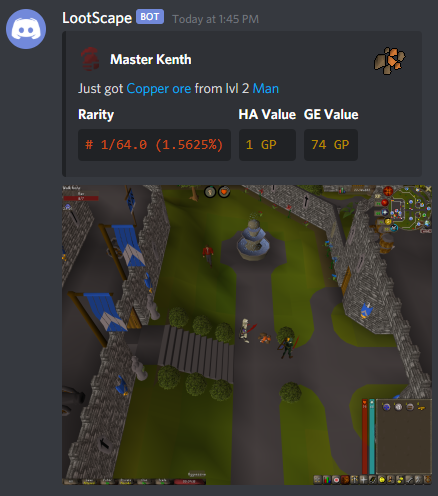
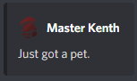
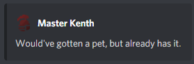
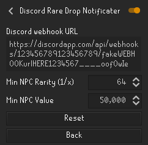

# Discord Rare Drop Notifier
__Plugin for RuneLite__

## Description
This is a plugin for automatically posting a Discord channel message and screenshot whenever the user gets a rare item drop, either from a kill or from looting events such as Barrows or Chambers of Xeric.

Item rarity for NPC kills uses [OSRSBox API](https://api.osrsbox.com/index.html). 

Item rarity for events (Barrows, Clue Scrolls etc.) have been manually scraped from the [OSRS Wiki](https://oldschool.runescape.wiki/).

## Features
* Show account type icon (Ironman variants)
* Show item icon
* Post screenshot
* Show item rarity
* Show item HA/GE values
* OSRS wiki links for item and npc killed
* Pet drop notification (rudimentary)

## Configuration

### Discord webhook URL
This is the webhook URL setup in Discord. Follow [these instructions](https://support.discord.com/hc/en-us/articles/228383668-Intro-to-Webhooks) to setup.

### Min NPC Rarity
For NPC drops (kills), any drop with a rarity equal to or more than this value will be posted to Discord.

The value is the divider, so 64 (default) means 1 in 64 or approximately 1.6% drop rate.

This value is OR'd with **Min NPC Value**, meaning the drop will be posted if it's _either_ this rare, or worth equal to or more than Min NPC Value.

### Min NPC Value
For NPC drops (kills), any drop worth equal to or more than this value will be posted to Discord.

Value is calculated as the largest value between Grand Exchange and High Alchemy.

This value is OR'd with **Min NPC Rarity**, meaning the drop will be posted if it's _either_ worth equal to or more than this, or equal to or more rare than Min NPC Rarity.

## TODO
* Get pet info when a pet drop is detected
* Logically combine notification with screenshot (right now if any notification fails no screenshots are sent at all)

## Misc
This project follows [Semantic Commit Messages](https://seesparkbox.com/foundry/semantic_commit_messages).

## Original Author
Huge thanks to @MasterKenth for creating this plugin.