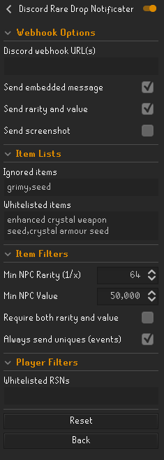

# Discord Rare Drop Notifier
__Plugin for RuneLite__

## Description
This is a plugin for automatically posting a Discord channel message and screenshot whenever the user gets a rare item drop, either from a kill or from looting events such as Barrows or Chambers of Xeric.

Item rarity for NPC kills uses [OSRSBox API](https://api.osrsbox.com/index.html). 

Item rarity for events (Barrows, Clue Scrolls etc.) have been manually scraped from the [OSRS Wiki](https://oldschool.runescape.wiki/).

## Features
* Show account type icon (Ironman variants)
* Show item icon
* Post screenshot
* Show item rarity
* Show item HA/GE values
* OSRS wiki links for item and npc killed
* Pet drop notification (rudimentary)

## Configuration

### Webhook options

**Discord webhook URL(s):** These are the webhook URLs for Discord or other services. 
Follow [these instructions](https://support.discord.com/hc/en-us/articles/228383668-Intro-to-Webhooks) to setup in discord.
*Separated by a newline.*

**Send embedded message:** Enable to send the embed message instead of a text message.

**Send rarity and value:** Enable to add rarity and values to the embed message.

**Send screenshot:** Enable to automatically send a screenshot as a separate message on item drop.

### Item lists

**Whitelisted items:** When exactly matched this will always send the notification, no matter of other settings. When partially matched and **no** exact ignored items are matched, this will also be sent.

**Ignored items:** Will ignore all items in this list, only the _whitelisted_ will be sent.

### Item filters

**Min NPC Rarity (1/x):** For NPC drops (kills), any drop with a rarity equal to or more than this value will be posted to Discord.
The value is the divider, so 64 (default) means 1 in 64 or approximately 1.6% drop rate.

**Min NPC Value:** For NPC drops (kills), any drop worth equal to or more than this value will be posted to Discord.
Value is calculated as the largest value between Grand Exchange and High Alchemy.

**Require both rarity and value:** Enable when _both_ requirements need to be met. **Default it's either** requirement.

**Always send uniques:** When enabled and the item is not blacklisted, the webhooks will be notified of any uniques. _note_ our system must be able to identify the drop as an unique. 

## Thanks to

**Original author:** @MasterKenth

**Current repository owner:** @BossHuso

**and other contributors!**